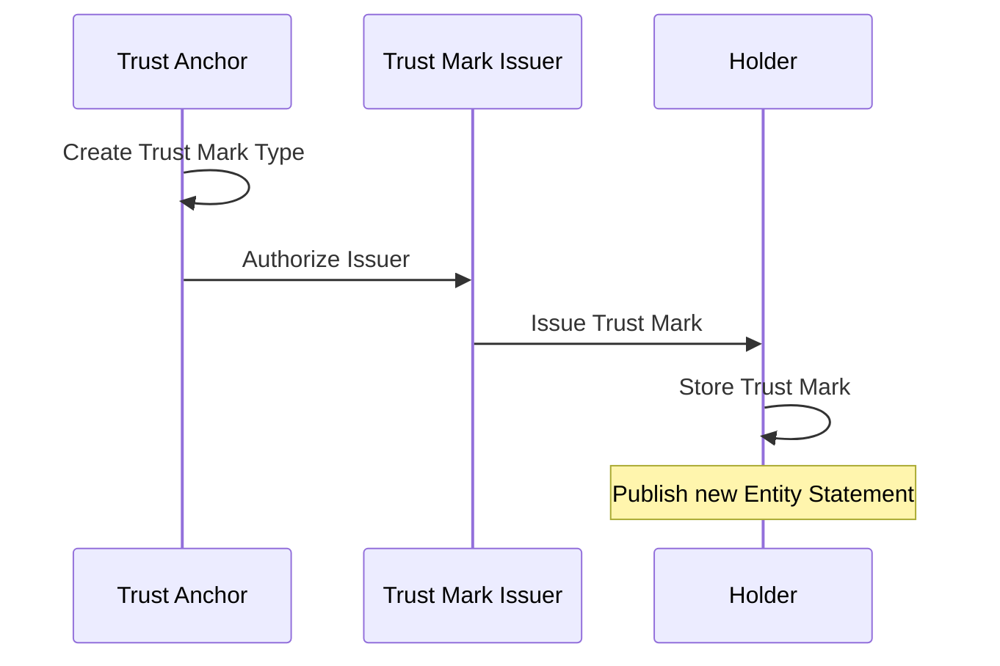

<h1 align="center">
  <br>
  <a href="https://www.sphereon.com"></a>
  <br>OpenID Federation Monorepo
  <br>
  <br>
</h1>

<div align="center">

[](https://hub.docker.com/r/sphereon/openid-federation-server)
[](LICENSE)

</div>

# Background

OpenID Federation is a framework designed to facilitate the secure and interoperable interaction of entities within a
federation. This involves the use of JSON Web Tokens (JWTs) to represent and convey necessary information for entities
to participate in federations, ensuring trust and security across different organizations and systems.

# Key Concepts

- **Federation**: A group of organizations that agree to interoperate under a set of common rules defined in a
  federation policy.
- **Entity Statements**: JSON objects that contain metadata about entities (IdPs, RPs) and their federation
  relationships.
- **Trust Chains**: Mechanisms by which parties in a federation verify each other’s trustworthiness through a chain of
  entity statements, leading back to a trusted authority.
- **Federation API**: Interfaces defined for entities to exchange information and perform operations necessary for
  federation management.

## Core Components

- **Federation Operator**: The central authority in a federation that manages policy and trust chain verification.
- **Identity Providers (IdPs)**: Entities that authenticate users and provide identity assertions to relying parties.
- **Relying Parties (RPs)**: Entities that rely on identity assertions provided by IdPs to offer services to users.

## Technical Features

- **JSON Web Tokens (JWT)**: Used for creating verifiable entity statements and security assertions.
- **JSON Object Signing and Encryption (JOSE)**: Standards for signing and encrypting JSON-based objects to ensure their
  integrity and confidentiality.

# API Reference

For the complete API documentation, please visit:

- [Admin Server API Reference](https://app.swaggerhub.com/apis-docs/SphereonInt/OpenIDFederationAdminServer/0.1.0-d41)
- [Federation Server API Reference](https://app.swaggerhub.com/apis-docs/SphereonInt/OpenIDFederationServer/0.1.0-d41)

# Servers Deployment Instructions

## Docker Setup

For seamless deployment of the OpenID Federation servers, Docker and Docker Compose offer the most efficient and
straightforward approach.

## Essential Commands

### Build Docker Images

- `docker compose build` - Compile the Docker images for the services.
- `docker compose build --no-cache` - Compile the Docker images without utilizing the build cache, ensuring a clean
  build.

### Manage Services:

- `docker compose up` - Initiate all the services.
- `docker compose up -d` - Launch all the services in detached mode, allowing them to run in the background.
- `docker compose down` - Terminate the services.
- `docker compose down -v` - Terminate the services and remove associated volumes.
- `docker compose up db -d` - Start only the database container in detached mode for isolated database operations.
- `docker compose up federation-server -d` - Start only the Federation Server in detached mode.

## API Endpoints via Docker

* Federation API: Accessible at http://localhost:8080
* Admin Server API: Accessible at http://localhost:8081
* Default Keycloak Server: Accessible at http://localhost:8082

# OpenID Federation Configuration Guide

This guide will help new users configure and deploy the OpenID Federation service, including setting up environment
variables, the root entity, and necessary dependencies. Follow the steps outlined below.

## Important Notices

### Publishing Updates

Any changes affecting Entity Statements or Subordinate Statements must be explicitly published to take effect. This
includes:

- Metadata changes
- Trust Mark modifications
- Configuration updates
- Key rotations

### Local Key Management System

The Local Key Management Service is designed primarily for testing, development, and local experimentation
purposes. **It is not intended for use in production environments** due to significant security and compliance risks.

## Introduction

The system comes with a preconfigured "root" account entity that responds to the root URL identifier's endpoints (
e.g., `/.well-known/openid-federation`) and not tenant account endpoints. This account is used for managing
configurations specific to the root entity.


---

## Step 1: Configure Environment Variables

Set the following environment variables in your deployment environment. These variables are critical for configuring the
service and connecting to the required resources.

### General Configuration

```env
APP_KEY=Nit5tWts42QeCynT1Q476LyStDeSd4xb
# A 32-byte random string that every deployer needs to create. It is used for application-level security.

ROOT_IDENTIFIER=http://localhost:8081
# The OpenID identifier of the root entity. It must be a valid URL hosting the well-known endpoint.

DATASOURCE_URL=jdbc:postgresql://db:5432/openid-federation-db
# The database instance URL. Defaults to the Docker Compose PostgreSQL instance.

DATASOURCE_USER=openid-federation-db-user
# The username for the database.

DATASOURCE_PASSWORD=openid-federation-db-password
# The password for the database.

DATASOURCE_DB=openid-federation-db
# The database name.
```

### Key Management System (KMS)

```env
KMS_PROVIDER=local
# Defaults to the local KMS provider that runs on Docker. **Do not use in production.**

LOCAL_KMS_DATASOURCE_URL=jdbc:postgresql://local-kms-db:5432/openid-federation-local-kms-db
# The database instance URL for the local KMS.

LOCAL_KMS_DATASOURCE_USER=openid-federation-local-kms-db-user
# The username for the local KMS database.

LOCAL_KMS_DATASOURCE_PASSWORD=openid-federation-local-kms-db-password
# The password for the local KMS database.

LOCAL_KMS_DATASOURCE_DB=openid-federation-local-kms-db
# The database name for the local KMS.
```

### Keycloak OAuth2 Provider

```env
KC_BOOTSTRAP_ADMIN_USERNAME=admin
# Default username for the local Keycloak OAuth2 provider.

KC_BOOTSTRAP_ADMIN_PASSWORD=admin
# Default password for the local Keycloak instance.

OAUTH2_RESOURCE_SERVER_JWT_ISSUER_URI=http://keycloak:8080/realms/openid-federation
# The JWT issuer URI for the local Keycloak instance.
```

---

### Notes:

1. Replace default values (e.g., `admin`, `localhost`, `password`) with secure values for production environments.
2. Ensure the `ROOT_IDENTIFIER` is a publicly accessible URL if deploying in a live environment.
3. Use a production-grade KMS provider in production environments instead of the local Docker-based KMS.

## Step 2: Start the Service Stack

Once the environment variables are configured, you can start the OpenID Federation service stack using Docker Compose:

```bash
docker compose up
```

This command will initialize all necessary services, including the database, KMS provider, and Keycloak, as defined in
the Docker Compose configuration file.

---

## Step 3: Obtain an Access Token

The admin endpoints are protected and require a valid JWT access token. To acquire one, follow these steps:

### Using Keycloak Token Endpoint

1. **Send a POST Request to the Keycloak Token Endpoint**:

   ```http
   POST http://localhost:8082/realms/openid-federation/protocol/openid-connect/token
   ```

2. **Provide the Required Credentials in the Request Body**:

   Use `x-www-form-urlencoded` format with the following parameters:

   ```text
   grant_type=client_credentials
   client_id=openid-client
   client_secret=th1s1s4s3cr3tth4tMUSTb3ch4ng3d
   ```

3. **Example cURL Command**:

   ```bash
   curl -X POST http://localhost:8082/realms/openid-federation/protocol/openid-connect/token \
     -H "Content-Type: application/x-www-form-urlencoded" \
     -d "grant_type=client_credentials" \
     -d "client_id=openid-client" \
     -d "client_secret=th1s1s4s3cr3tth4tMUSTb3ch4ng3d"
   ```

4. **Parse the Response**:

   A successful request returns a JSON object. Extract the `access_token` field:

   ```json
   {
       "access_token": "eyJhbGciOiJSUzI1NiIsInR5cCI6IkpXVCJ9...",
       "expires_in": 300,
       "token_type": "Bearer",
       "not-before-policy": 0,
       "scope": "openid"
   }
   ```

5. **Use the Access Token in Subsequent API Requests**:

   Add the `access_token` to the `Authorization` header:

   ```http
   Authorization: Bearer <access_token>
   ```

### Notes

- Replace `client_secret` with a secure value in a production environment.
- The token expires after a specified duration (`expires_in` field). Acquire a new token as needed.

---

## Step 4: Create a New Tenant Account

To create a new tenant account, follow these steps:

1. Send a `POST` request to the following endpoint:

   ```http
   POST http://localhost:8081/accounts
   ```

2. Include a JSON body with the desired account details. For example:

   ```json
   {
       "username": "{username}",
       "identifier": "https://example.com/{username}"
   }
   ```

Note: All subsequent requests will use the `X-Account-Username` header to specify the account context. If not provided,
it defaults to the root account.

## Step 5: Delete a Tenant Account

To delete a tenant account, follow these steps:

1. Send a `DELETE` request to the following endpoint:

   ```http
   DELETE http://localhost:8081/accounts
   X-Account-Username: {username} # root account cannot be deleted
   ```

## Step 6: Create and Manage Keys

### Create a New Key Pair

1. Send a `POST` request to create a new key pair:

   ```http
   POST http://localhost:8081/keys
   X-Account-Username: {username}  # Optional, defaults to root
   ```

### List Keys

1. Send a `GET` request to list the keys:

   ```http
   GET http://localhost:8081/keys
   X-Account-Username: {username}  # Optional, defaults to root
   ```

### Revoke a Key

1. Send a `DELETE` request to revoke a key:

   ```http
   DELETE http://localhost:8081/keys/{keyId}
   X-Account-Username: {username}  # Optional, defaults to root
   ```

2. Optionally, include a `reason` query parameter to specify the reason for revocation:

   ```http
   DELETE http://localhost:8081/keys/{keyId}?reason=Key+compromised
   X-Account-Username: {username}  # Optional, defaults to root
   ```

## Step 7: Define Metadata for an Entity

To assign metadata to your entity, follow these steps:

1. Send a `POST` request to the following endpoint:

   ```http
   POST http://localhost:8081/metadata
   X-Account-Username: {username}  # Optional, defaults to root
   ```

2. Include a JSON body with the metadata details. For example:

   ```json
   {
       "key": "basic_metadata",
       "metadata": {
           "client_uri": "https://example.com",
           "contacts": [
               "admin@example.com",
               "support@example.com"
           ]
       }
   }
   ```

### List Metadata for an Entity

1. Send a `GET` request to list all metadata:

   ```http
   GET http://localhost:8081/metadata
   X-Account-Username: {username}  # Optional, defaults to root
   ```

### Delete Metadata by ID

1. Send a `DELETE` request to delete a metadata entry by its ID:

   ```http
   DELETE http://localhost:8081/metadata/{id}
   X-Account-Username: {username}  # Optional, defaults to root
   ```

---

## Step 8: Manage Authority Hints

Authority Hints are used to indicate which authorities an entity recognizes in the federation. These authorities can
validate trust chains and issue trust marks.

### List Authority Hints

Send a GET request to retrieve all authority hints for an account:

```http
GET http://localhost:8081/authority-hints
X-Account-Username: {username}  # Optional, defaults to root
```

### Add an Authority Hint

Send a POST request to add a new authority hint:

```http
POST http://localhost:8081/authority-hints
X-Account-Username: {username}  # Optional, defaults to root
{
    "identifier": "https://example.com/authority"
}
```

### Remove an Authority Hint

Send a DELETE request to remove an authority hint by its ID:

```http
DELETE http://localhost:8081/authority-hints/{id}
X-Account-Username: {username}  # Optional, defaults to root
```

Remember to publish your entity configuration after making changes to authority hints for them to take effect.

---

## Step 9: Create and Manage Subordinates

### Create a New Subordinate

1. Send a `POST` request to the following endpoint:

   ```http
   POST http://localhost:8081/subordinates
   X-Account-Username: {username}  # Optional, defaults to root
   ```

2. Include a JSON body with the subordinate details. For example:

   ```json
   {
       "identifier": "https://example.com/subordinate1"
   }
   ```

### List Subordinates

1. Send a `GET` request to list all subordinates:

   ```http
   GET http://localhost:8081/subordinates
   X-Account-Username: {username}  # Optional, defaults to root
   ```

### Delete a Subordinate

1. Send a `DELETE` request to delete a subordinate by its ID:

   ```http
   DELETE http://localhost:8081/subordinates/{id}
   X-Account-Username: {username}  # Optional, defaults to root
   ```

---

## Step 10: Manage Subordinate Metadata

### Add Metadata to a Subordinate

1. Send a `POST` request to the following endpoint:

   ```http
   POST http://localhost:8081/subordinates/{subordinateId}/metadata
   X-Account-Username: {username}  # Optional, defaults to root
   ```

2. Include a JSON body with the metadata details. For example:

   ```json
   {
       "key": "example_key",
       "metadata": {
           "description": "Example metadata description"
       }
   }
   ```

### List Metadata for a Subordinate

1. Send a `GET` request to list all metadata for a subordinate:
   ```http
   GET http://localhost:8081/subordinates/{subordinateId}/metadata
   X-Account-Username: {username}  # Optional, defaults to root
   ```

### Delete Metadata by ID

1. Send a `DELETE` request to delete a metadata entry by its ID:
   ```http
   DELETE http://localhost:8081/subordinates/{subordinateId}/metadata/{id}
   X-Account-Username: {username}  # Optional, defaults to root
   ```

---

## Step 11: Manage Subordinate JWKS

### Add a JWKS for a Subordinate

1. Send a `POST` request to the following endpoint:

   ```http
   POST http://localhost:8081/subordinates/{id}/jwks
   X-Account-Username: {username}  # Optional, defaults to root
   ```

2. Include a JSON body with the JWKS details. For example:

   ```json
   {
       "key": "example_key",
       "key_ops": ["sign", "verify"],
       "kty": "RSA"
   }
   ```

### List JWKS for a Subordinate

1. Send a `GET` request to list all JWKS for a subordinate:

   ```http
   GET http://localhost:8081/subordinates/{id}/jwks
   X-Account-Username: {username}  # Optional, defaults to root
   ```

### Delete a JWKS by ID

1. Send a `DELETE` request to delete a JWKS entry by its ID:

   ```http
   DELETE http://localhost:8081/subordinates/{id}/jwks/{jwkId}
   X-Account-Username: {username}  # Optional, defaults to root
   ```

---

## Step 12: Get Subordinate Statement Object

1. Send a `GET` request to retrieve the statement for a subordinate:

   ```http
   GET http://localhost:8081/subordinates/{id}/statement
   X-Account-Username: {username}  # Optional, defaults to root
   ```

---

## Step 13: Publish Subordinate Statement

1. Send a `POST` request to publish a subordinate statement:

   ```http
   POST http://localhost:8081/subordinates/{id}/statement
   X-Account-Username: {username}  # Optional, defaults to root
   ```

2. Optionally include a `dry-run` parameter in the request body to test the statement publication without making
   changes:

   ```json
   {
       "dry-run": true
   }
   ```

---

## Step 14: Get and Publish Entity Configuration Statement

### Get Entity Configuration Statement Object

1. Send a `GET` request to retrieve the entity configuration statement:

   ```http
   GET http://localhost:8081/entity-statement
   X-Account-Username: {username}  # Optional, defaults to root
   ```

### Publish Entity Configuration Statement Object

1. Send a `POST` request to publish the entity configuration statement:

   ```http
   POST http://localhost:8081/entity-statement
   X-Account-Username: {username}  # Optional, defaults to root
   ```

2. Optionally, include a `dry-run` parameter in the request body to test the statement publication without making
   changes:

   ```json
   {
       "dry-run": true
   }
   ```

# Trust Marks

## Trust Mark Workflow



## Example Implementation Steps

### 1. Trust Anchor Setup

```http
# Create Trust Anchor account
POST http://localhost:8081/accounts
{
    "username": "trust-anchor",
    "identifier": "https://example.com/trust-anchor"
}

# Generate Trust Anchor keys
POST http://localhost:8081/keys
X-Account-Username: trust-anchor

# Create Trust Mark type
POST http://localhost:8081/trust-mark-types
X-Account-Username: trust-anchor
{
    "identifier": "https://example.com/trust-mark-types/exampleType"
}

# Create Issuer account
POST http://localhost:8081/accounts
{
    "username": "trust-mark-issuer",
    "identifier": "https://example.com/issuer"
}

# Generate Issuer keys
POST http://localhost:8081/keys
X-Account-Username: trust-mark-issuer

# Authorize Issuer
POST http://localhost:8081/trust-mark-types/{type-id}/issuers
X-Account-Username: trust-anchor
{
    "identifier": "https://example.com/issuer"
}

# Publish Trust Anchor configuration
POST http://localhost:8081/entity-statement
X-Account-Username: trust-anchor

# Issue Trust Mark
POST http://localhost:8081/trust-marks
X-Account-Username: trust-mark-issuer
{
    "sub": "https://example.com/holder",
    "trust_mark_type_identifier": "https://example.com/trust-mark-types/exampleType"
}

# Publish Issuer configuration
POST http://localhost:8081/entity-statement
X-Account-Username: trust-mark-issuer

# Create Holder account
POST http://localhost:8081/accounts
{
    "username": "holder",
    "identifier": "https://example.com/holder"
}

# Store Trust Mark
POST http://localhost:8081/received-trust-marks
X-Account-Username: holder
{
    "trust_mark_type_identifier": "https://example.com/trust-mark-types/exampleType",
    "jwt": "eyJ..."
}

# Publish Holder configuration
POST http://localhost:8081/entity-statement
X-Account-Username: holder

### 5. Trust Mark Verification

```http
# Verify Trust Mark status
GET http://localhost:8080/trust-mark-issuer/trust-mark-status
{
    "trust_mark_id": "https://example.com/trust-mark-types/exampleType",
    "sub": "https://example.com/holder"
}
```

# License

```
Apache License Version 2.0
```

---

## Maintainers

- John Melati
- Niels Klomp
- Zoë Maas
- Sander Postma
