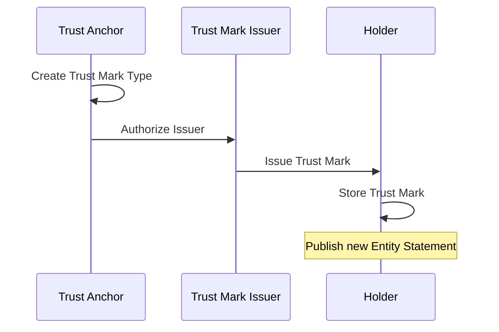

<h1 align="center">
  <br>
  <a href="https://www.sphereon.com"></a>
  <br>OpenID Federation multiplatform
  <br>
  <br>
</h1>

<div align="center">

[](https://hub.docker.com/r/sphereon/openid-federation-server)
[](LICENSE)

</div>

# OpenID Federation multiplatform Server and client

Welcome to the OpenID Federation project. This repository implements a Kotlin Multiplatform solution, enabling shared
code across multiple platforms (such as the JVM, JS, and
Native). Whether you are a developer familiar with Kotlin or new to multiplatform projects, this guide will help you
understand the core concepts, architecture, and deployment
instructions for the project.

---

## Background

OpenID Federation is a framework designed to facilitate secure and interoperable interactions among entities within a
federation. It utilizes JSON Web Tokens (JWTs) to securely
represent and transmit necessary metadata, ensuring trust and security across various organizations and systems.

---

## Key Concepts

- **Federation**: A group of organizations that agree to interoperate under a common set of rules defined in a
  federation policy.
- **Entity Statements**: JSON objects containing metadata about entities (such as Identity Providers and Relying
  Parties) along with their federation relationships.
- **Trust Chains**: Mechanisms by which entities verify one another's trustworthiness by following a chain of entity
  statements back to a trusted authority.
- **Federation API**: Standardized interfaces to exchange information and perform operations crucial for federation
  management.

---

## Core Components

- **Federation Operator**: The central authority in the federation responsible for policy management and trust chain
  verification.
- **Identity Providers (IdPs)**: Entities that authenticate users and issue identity assertions to relying parties.
- **Relying Parties (RPs)**: Entities that rely on the received identity assertions to provide services to users.

---

## Technical Features

- **JSON Web Tokens (JWT)**: Employed to create verifiable entity statements and security assertions.
- **JSON Object Signing and Encryption (JOSE)**: Standards used for signing and encrypting JSON objects to ensure
  integrity and confidentiality.

---

## Kotlin Multiplatform

This project is developed as a Kotlin Multiplatform project. The goal of this approach is to maximize code reuse and
maintain consistency across different platforms:

- **Common Code**: Shared modules include the business logic and core functionality, written in pure Kotlin.
- **Platform-Specific Implementations**: Platform-dependent modules exist for code that needs to interact with specific
  operating system or ecosystem features.
- **Supported Platforms**: Typically, the project targets the JVM, JavaScript, and native environments. Consult the
  project’s build configuration for platform-specific details.
- **Development Setup**: Ensure you have the latest version of Kotlin and the appropriate SDKs installed for the
  platforms you intend to target.

---

## API Reference

For complete API details, please refer to the following resources:

- [Admin Server API Reference](https://app.swaggerhub.com/apis/4Sure/OpenIDFederationAdminServer/0.20.0-d41)
- [Federation Server API Reference](https://app.swaggerhub.com/apis/4Sure/OpenIDFederationServer/0.20.0-d41)

---

## Servers Deployment Instructions

### Environment variables

We are using environment variables to configure certain components, like for instance the key management system. This is
independent of the deployment you choose, like using the
docker compose, or running the API servers directly on a JVM. In the root folder you will find
the [.env.example](.env.example) file. Copy this file to `.env` or `.env.local`.

The docker compose method should automatically pick up the environment variables you put in there.

### Docker Setup

For seamless deployment of the OpenID Federation servers, Docker and Docker Compose are recommended. Docker provides an
efficient and straightforward deployment and orchestration
environment.

### Essential Commands

#### Docker Hub Images

The following Docker Hub images are available for the OpenID Federation project:

-   **OpenID Federation Admin Server:** [https://hub.docker.com/r/sphereon/openid-federation-admin-server](https://hub.docker.com/r/sphereon/openid-federation-admin-server)
-   **OpenID Federation Server:** [https://hub.docker.com/r/sphereon/openid-federation-server](https://hub.docker.com/r/sphereon/openid-federation-server)

These images can be used to quickly deploy the services in a containerized environment. You can use the `docker compose` file to pull these images, or you can pull them directly using `docker pull`.

#### Build Docker Images

- `docker compose build`  
  Compile the Docker images for the services.

- `docker compose build --no-cache`  
  Build the Docker images without using the cache to ensure a clean build.

#### Manage Services

- `docker compose up`  
  Initiate all services.

- `docker compose up -d`  
  Launch all services in detached mode (running in the background).

- `docker compose down`  
  Terminate all running services.

- `docker compose down -v`  
  Terminate services and remove associated volumes.

- `docker compose up db -d`  
  Start only the database container in detached mode.

- `docker compose up openid-federation-server -d`  
  Start only the Federation Server in detached mode.

### API Endpoints (via Docker)

- **Federation API**: Accessible at http://localhost:8080
- **Admin Server API**: Accessible at http://localhost:8081 (always requires `Authorization: Bearer …`)
- **Default Keycloak Server** (JWT issuer for admin): Accessible at http://localhost:8082

Admin compose service waits for **db** and **keycloak** (healthy). Issuer defaults to
`http://keycloak:8080/realms/openid-federation` via `OIDF_OAUTH2_ISSUER_URI` /
`OAUTH2_RESOURCE_SERVER_JWT_ISSUER_URI` (see `.env.example`). Compose local stacks use **account** mode by
default. There is no configuration switch to run the admin API without authentication; see
[Identity modes](#identity-modes-account-and-external) below.

# OpenID Federation Configuration Guide

This guide will help new users configure and deploy the OpenID Federation service, including setting up environment
variables, the root entity, and necessary dependencies. Follow the steps outlined below.

## Important Notices

### Publishing Updates

Any changes affecting Entity Statements or Subordinate Statements must be explicitly published to take effect. This
includes:

- Metadata changes
- Trust Mark modifications
- Configuration updates
- Key rotations

### Local Key Management System

The Local Key Management Service (in-memory) is designed primarily for testing, development, and local experimentation
purposes. **It is not intended for use in production environments** due to significant security and compliance risks.

## Introduction

The federation service stores configuration, keys, and trust data per **entity context**. How that context is chosen,
and who is allowed to call the admin API, depends on the **identity mode**. From 0.25.0 there are two modes:
**account** (the historical standalone model, and still the default) and **external** (an OAuth2 / OIDC authorization
server owns subjects and tenants). Both modes require a valid Bearer access token on every admin call except health and
debug endpoints. There is no longer a configuration switch to turn admin authentication off.

Detailed design notes live in [docs/IDENTITY_AND_IDK_ALIGNMENT.md](docs/IDENTITY_AND_IDK_ALIGNMENT.md). End-to-end
testing with an in-process IDK authorization server is described in [docs/PLATFORM_E2E.md](docs/PLATFORM_E2E.md).

---

## Identity modes: account and external

Admin authentication is always JWT-based. The identity mode controls **where the federation entity (tenant) context
comes from**, not whether a token is required.

Set the mode with `OIDF_IDENTITY_MODE` (or the config key `oidf.identity.mode`):

| Value | Meaning |
|-------|---------|
| `account` (default) | Pre-0.25.0 standalone model. Federation entities are `Account` rows managed via `/accounts`. |
| `external` | Host or platform embedding. Tenant id comes only from claims on the access token. |
| `legacy` | Accepted alias for `account`. |
| `platform` | Accepted alias for `external`. |

### Account mode (standalone, pre-0.25.0 model)

This is the original open-source multi-entity model and remains the default.

The database seeds a special **root** account. Its federation entity identifier is `ROOT_IDENTIFIER` /
`OIDF_FEDERATION_ROOT_IDENTIFIER` (for example `http://localhost:8080`). The root account serves the federation
well-known document at that base URL. Additional entities are ordinary accounts created through `POST /accounts`.
Each non-root account gets an identifier such as `{root}/{username}` unless you supply an explicit identifier.

Every admin request must present `Authorization: Bearer <access_token>`. After the token is validated, the server
opens a session bound to an entity context (normally the root account when the token does not name another tenant).
To operate on a different account you may send `X-Account-Username` with the target username. That header is **entity
selection**, not authentication. It only succeeds when the authenticated principal appears on a configured allow-list
(see below). If the username is unknown the server returns 404; if the principal is not allowed to rebind, 403.

By default the allow-list is **empty**, so header rebind is denied for everyone until you list the operators who may
switch entity context. Matching uses a JWT claim (default `sub`) against
`OIDF_ACCOUNT_HEADER_ALLOWED_PRINCIPALS`. A single `*` allows any authenticated principal and is intended only for
local tests, not production.

Account REST (`GET` / `POST` / `DELETE /accounts`) is registered only in this mode (and only when the
`openid-federation-account-http` module is on the classpath, which it is for the all-in-one admin server in this repo).

Typical Docker Compose and Keycloak setup in this README assumes **account** mode.

### External mode (authorization server / OIDC host)

External mode is for deployments where an external authorization server (or the Sphereon IDK OAuth2 AS) already
manages users, organizations, and which caller may act as which tenant. OpenID Federation does not run its own
account registry in this mode: `/accounts` is not registered (and returns 410 if hit), and `X-Account-Username` is
never used for identity.

The access token is still required and validated against `OIDF_OAUTH2_ISSUER_URI`. After validation the server reads
tenant claims from the token (`tenant_id`, `tid`, and related IDK claim names) and sets `SessionExecution.tenantId` to
that value. All domain data for the request is isolated under that tenant. If a protected admin route receives a
token with no usable tenant claim, the request fails closed with 401.

On first contact with a new token tenant id the server can auto-provision a federation row
(`FederationTenantProvisioner`, `tenant_source = idk`). Party, user, and organization management stay in the host
identity product; OIDFed only stores federation material (keys, entity configuration, subordinates, trust marks)
keyed by that tenant id.

#### Root entity URL versus token tenants (external)

In external mode there is **no privileged root login account** inside OIDFed. What remains is a mapping for the
federation **root entity URL**:

`OIDF_EXTERNAL_ROOT_TENANT_ID` / `oidf.identity.external.root.tenant.id` names which token tenant id owns the
federation root identifier (`ROOT_IDENTIFIER`). Other tenants typically receive entity identifiers under
`{root}/tenants/{tenantId}` unless your host overrides that layout.

That mapping only answers “which validated session tenant publishes as the root entity URL?”. It is not a back door
to elevate an unauthenticated caller, and it is not a substitute for the access token.

#### Delegation and STS (external)

If operator A must act as tenant B, that is expressed **by the authorization server**, for example through token
exchange, on-behalf-of / STS flows, or actor and delegation claims the AS puts on the access token. OIDFed fully
trusts the validated token’s tenant (and related) claims. It does not implement its own impersonation API, does not
accept client-supplied headers to change tenant, and does not re-check AS policy beyond JWT validation and the
required tenant claim.

Configure the issuer so tokens carry a stable tenant claim your host already uses. Automated EXTERNAL e2e tests mint
such tokens with the in-process IDK OAuth2 AS; see [docs/PLATFORM_E2E.md](docs/PLATFORM_E2E.md).

### Admin authentication is always on

Earlier versions allowed an “anonymous admin” / no-auth style configuration for local development. That escape hatch
has been **removed for security**. Related environment variables and config keys (including anything that disabled
JWT requirement on the admin server) are gone. The admin server requires a non-blank OAuth2 issuer at startup and
installs JWT authentication with `requireAuth=true`.

Integration tests obtain Bearer tokens from an in-process IDK OAuth2 AS rather than disabling auth. Compose-based
local development continues to use Keycloak (or any OIDC issuer you point `OIDF_OAUTH2_ISSUER_URI` at).

Public federation protocol endpoints on the federation server remain open by design (entity configuration,
subordinate listing, trust mark endpoints as specified by OpenID Federation). Only the **admin** API always requires
Bearer tokens.

### Useful identity-related variables

```env
# account (default) or external. Aliases: legacy, platform
OIDF_IDENTITY_MODE=account

# ACCOUNT: JWT claim used to match the header allow-list (default sub)
# OIDF_ACCOUNT_HEADER_PRINCIPAL_CLAIM=sub

# ACCOUNT: comma-separated principals allowed to send X-Account-Username.
# Default empty = deny rebind for everyone. Use * only in tests.
# OIDF_ACCOUNT_HEADER_ALLOWED_PRINCIPALS=

# EXTERNAL: token tenant id that owns the federation root entity URL
# OIDF_EXTERNAL_ROOT_TENANT_ID=

# Required for admin JWT validation (startup fails if blank)
OIDF_OAUTH2_ISSUER_URI=http://keycloak:8080/realms/openid-federation
# OIDF_OAUTH2_AUDIENCE=openid-federation-admin
```

---

## Postman collection

This README show the steps to interact with the API down below. You can use a tool like CURL or use the Swagger UI to
interact with the API. We have also
included [a postman collection](./resources/OIDF.postman_collection.json) you can import into Postman. It contains
examples for most endpoints and also at the toplevel has an
OAUth2 integration. So you can get an access token from the toplevel folder and then use that token automatically in
subsequent calls.

## Step 1: Configure Environment Variables

Set the following environment variables in your deployment environment. These variables are critical for configuring the
service and connecting to the required resources.

### General Configuration

**Note:** See the notes above about copying the .env.example to .env or .env.local first

```env
APP_KEY=Nit5tWts42QeCynT1Q476LyStDeSd4xb
# A 32-byte random string that every deployer needs to create. It is used for application-level security.

ROOT_IDENTIFIER=http://localhost:8081
# The OpenID identifier of the root entity. It must be a valid URL hosting the well-known endpoint.

DATASOURCE_URL=jdbc:postgresql://db:5432/openid-federation-db
# The database instance URL. Defaults to the Docker Compose PostgreSQL instance.

DATASOURCE_USER=openid-federation-db-user
# The username for the database.

DATASOURCE_PASSWORD=openid-federation-db-password
# The password for the database.

DATASOURCE_DB=openid-federation-db
# The database name.
```

See [.env.example](.env.example) for all the allowd values and their explanations

### Key Management System (KMS)

The service supports multiple KMS providers. Use the environment variable `KMS_PROVIDER` to select the desired provider:

- `memory`: In-memory KMS (for development and testing only!)
- `aws`: AWS Key Management Service
- `azure`: Azure Key Vault

#### In-Memory KMS (Default/testing)

```env
KMS_PROVIDER=memory
# When set to 'memory', the service uses a local in-memory key store for encryption and decryption.
```

**Note:** The memory KMS is not storing any private keys!. It is in memory, which means they will be gone after a
reboot. This was done on purpose, as you should use an external
KMS system with proper protection like Azure Keyvault or AWS KMS.

#### AWS KMS Example

When configured like below, AWS Key Management Service will be used. You need to provide your AWS region, and you will
also need to provide an access key id and secret.

**Creating an AWS Access Key and Secret Access Key**

1. **Sign In to AWS Management Console**
   Use your AWS account credentials to sign in at [https://aws.amazon.com/](https://aws.amazon.com/).
2. **Navigate to IAM (Identity and Access Management)**
    - In the AWS Management Console, search for **IAM** or select it from the list of services.
    - IAM lets you manage users, groups, roles, and their associated access credentials.

3. **Create or Select an IAM User**
    - If you already have a user for programmatic access, select that user from the **Users** tab.
    - Otherwise, to create a new user:
        - Click on **Add User**.
        - Enter a username.
        - Under **Select AWS Access Type**, check **Programmatic access** (this is needed to generate an access key and
          secret key).

4. **Set Permissions**
    * For initial testing of key management tasks, you could attach existing policies like *
      *AWSKeyManagementServicePowerUser*. This policy grants broad administrative permissions for KMS,
      allowing the creation and management of keys.
    * **Important:** The `AWSKeyManagementServicePowerUser` policy **does not** grant permissions to perform
      cryptographic signing operations. To enable signing operation, you must explicitly grant the `kms:Sign`
      permission.
    * For production environments, always follow the principle of least privilege, granting only the necessary
      permissions for the required tasks.

5. **Review and Create User**
    - Complete the steps and on the final screen, AWS will display an **Access Key ID** and **Secret Access Key**.
    - **Important:** Save your secret access key securely as it is shown only once. You can download the credentials as
      a CSV file.

Use the values from step 5 to set the Environment variables:

```env
KMS_PROVIDER=aws
# Use 'aws' to select AWS Key Management Service.

AWS_APPLICATION_ID=your-own-id
# The ID is only used internally and is not related to anything in AWS itself

AWS_REGION=your-aws-region-like-eu-west-1
# The AWS region where the KMS key is located. Example: eu-west-2

AWS_ACCESS_KEY_ID=your-aws-access-key
# Your AWS access key ID from step 5.

AWS_SECRET_ACCESS_KEY=your-aws-secret-access-key
# Your AWS secret access key from step 5.
```

Optional environment variables for AWS:

```env
AWS_MAX_RETRIES=5
# The maximum number of retries for operations against AWS KMS, defaults to 10.

AWS_BASE_DELAY=200
# The base delay (in milliseconds) before retrying a failed operation, defaults to 500

AWS_MAX_DELAY=2000
# The maximum delay (in milliseconds) to wait between retries, defaults to 15000
```

#### Azure Key Vault Example

```env
KMS_PROVIDER=azure
# Use 'azure' to select Azure Key Vault as the KMS.

AZURE_KEYVAULT_APPLICATION_ID=your-azure-app-id
# The Azure application (client) ID used to authenticate with Azure Key Vault.

AZURE_KEYVAULT_URL=https://your-keyvault-name.vault.azure.net/
# The URL for your Azure Key Vault instance.

AZURE_KEYVAULT_TENANT_ID=your-azure-tenant-id
# The Azure tenant ID used for authentication.

AZURE_KEYVAULT_CLIENT_ID=your-keyvault-client-id
# The client ID for the Azure Key Vault application.

AZURE_KEYVAULT_CLIENT_SECRET=your-keyvault-client-secret
# The client secret corresponding to the Azure Key Vault client.
```

Optional environment variables for Azure Keyvault:

```env
AZURE_KEYVAULT_MAX_RETRIES=5
# The maximum number of retries for operations against Azure Key Vault, defaults to 10

AZURE_KEYVAULT_BASE_DELAY=200
# The base delay (in milliseconds) before retrying a failed operation, defaults to 500

AZURE_KEYVAULT_MAX_DELAY=2000
# The maximum delay (in milliseconds) to wait between retries, defaults to 15000
```

### Keycloak OAuth2 Provider

```env
KC_BOOTSTRAP_ADMIN_USERNAME=admin
# Default username for the local Keycloak OAuth2 provider.

KC_BOOTSTRAP_ADMIN_PASSWORD=admin
# Default password for the local Keycloak instance.

OAUTH2_RESOURCE_SERVER_JWT_ISSUER_URI=http://keycloak:8080/realms/openid-federation
# The JWT issuer URI for the local Keycloak instance.
```

---

### Notes:

1. Replace default values (e.g., `admin`, `localhost`, `password`) with secure values for production environments.
2. Ensure the `ROOT_IDENTIFIER` is a publicly accessible URL if deploying in a live environment.
3. Select the appropriate KMS provider based on your environment:
    - For development or testing, the in-memory KMS is sufficient. Note: Keys are ephemeral and thus will be gone after
      a restart/reboot
    - For production, use AWS KMS or Azure Key Vault to ensure robust security for key management.
4. Never commit sensitive credentials (such as AWS or Azure secrets) into version control.

## Step 2: Start the Service Stack

Once the environment variables are configured, you can start the OpenID Federation service stack using Docker Compose:

```bash
docker compose up
```

This command will initialize all necessary services, including the database and Keycloak, as defined in
the Docker Compose configuration file.

---

## Step 3: Obtain an Access Token

The admin endpoints are protected and require a valid JWT access token. To acquire one, follow these steps:

### Using Keycloak Token Endpoint

1. **Send a POST Request to the Keycloak Token Endpoint**:

   ```http
   POST http://localhost:8082/realms/openid-federation/protocol/openid-connect/token
   ```

2. **Provide the Required Credentials in the Request Body**:

   Use `x-www-form-urlencoded` format with the following parameters:

   ```text

/

   ```

3. **Example cURL Command**:

   ```bash
   curl -X POST http://localhost:8082/realms/openid-federation/protocol/openid-connect/token \
     -H "Content-Type: application/x-www-form-urlencoded" \
     -d "grant_type=client_credentials" \
     -d "client_id=openid-client" \
     -d "client_secret=th1s1s4s3cr3tth4tMUSTb3ch4ng3d"
   ```

4. **Parse the Response**:

   A successful request returns a JSON object. Extract the `access_token` field:

   ```json
   {
       "access_token": "eyJhbGciOiJSUzI1NiIsInR5cCI6IkpXVCJ9...",
       "expires_in": 300,
       "token_type": "Bearer",
       "not-before-policy": 0,
       "scope": "openid"
   }
   ```

5. **Use the Access Token in Subsequent API Requests**:

   **Admin is always authenticated.** Every Admin API call (except `/health`) must include:

   ```http
   Authorization: Bearer <access_token>
   ```

   Without a valid Bearer token the admin server returns **401**.

### Notes

Replace `client_secret` with a secure value in a production environment. The token expires after the duration given in
`expires_in`; acquire a new token when needed.

Set `OIDF_OAUTH2_ISSUER_URI` (or the JVM alias `OAUTH2_RESOURCE_SERVER_JWT_ISSUER_URI`) so the admin server can
validate tokens. Startup fails if the issuer is blank. There is no environment variable to skip admin authentication.

The examples below assume **account** mode (the default). After authentication, send `X-Account-Username` when you
need to work on a non-root account and your principal is allow-listed for that rebind. The header selects the entity
context; it does not authenticate the caller. In **external** mode omit the header entirely: the token’s tenant claim
is the only entity context, and `/accounts` is not available.

---

## Step 4: Create a New Tenant Account (account mode)

Account REST applies only when `OIDF_IDENTITY_MODE=account` (or `legacy`). In external mode the host provisions
tenants outside this API.

1. Send a `POST` request to the following endpoint:

   ```http
   POST http://localhost:8081/accounts
   Authorization: Bearer <access_token>
   Content-Type: application/json
   ```

2. Include a JSON body with the desired account details. For example:

   ```json
   {
       "username": "{username}",
       "identifier": "http://localhost:8081/{username}"
   }
   ```

All admin requests need `Authorization: Bearer <access_token>`. Subsequent requests use `X-Account-Username` to select
the account context when the caller is allow-listed (defaults to the root account when the header is omitted).

## Step 5: Delete a Tenant Account (account mode)

To delete a tenant account, follow these steps:

1. Send a `DELETE` request to the following endpoint:

   ```http
   DELETE http://localhost:8081/accounts
   Authorization: Bearer <access_token>
   X-Account-Username: {username} # root account cannot be deleted
   ```

## Step 6: Create and Manage Keys

### Create a New Key Pair

1. Send a `POST` request to create a new key pair:

   ```http
   POST http://localhost:8081/keys
   Authorization: Bearer <access_token>
   X-Account-Username: {username}  # Optional, defaults to root
   ```

You can use the param kms_key_ref to assign a name to the key. This value will not end up in the JWK itself, but you can
use it for selecting which key to sign with. The kid value
could also be used, but that is typically not known upfront as in most cases it is generated as the SHA1 thumbprint of
the JWK.

You can also provide a JOSE/JWA signature algorithm provided the KMS configured supports it. Typical values are ES256,
ES384, ES512

 ```json
{
  "kmsKeyRef": "my-key",
  "signatureAlgorithm": "ES256"
}
   ```

### List Keys

1. Send a `GET` request to list the keys:

   ```http
   GET http://localhost:8081/keys
   Authorization: Bearer <access_token>
   X-Account-Username: {username}  # Optional, defaults to root
   ```

### Revoke a Key

1. Send a `DELETE` request to revoke a key:

   ```http
   DELETE http://localhost:8081/keys/{keyId}
   Authorization: Bearer <access_token>
   X-Account-Username: {username}  # Optional, defaults to root
   ```

2. Optionally, include a `reason` query parameter to specify the reason for revocation:

   ```http
   DELETE http://localhost:8081/keys/{keyId}?reason=Key+compromised
   Authorization: Bearer <access_token>
   X-Account-Username: {username}  # Optional, defaults to root
   ```

## Step 7: Define Metadata for an Entity

To assign metadata to your entity, follow these steps:

1. Send a `POST` request to the following endpoint:

   ```http
   POST http://localhost:8081/metadata
   Authorization: Bearer <access_token>
   X-Account-Username: {username}  # Optional, defaults to root
   ```

2. Include a JSON body with the metadata details. For example:

   ```json
   {
       "key": "basic_metadata",
       "metadata": {
           "client_uri": "http://localhost:8081",
           "contacts": [
               "admin@example.com",
               "support@example.com"
           ]
       }
   }
   ```

### List Metadata for an Entity

1. Send a `GET` request to list all metadata:

   ```http
   GET http://localhost:8081/metadata
   Authorization: Bearer <access_token>
   X-Account-Username: {username}  # Optional, defaults to root
   ```

### Delete Metadata by ID

1. Send a `DELETE` request to delete a metadata entry by its ID:

   ```http
   DELETE http://localhost:8081/metadata/{id}
   Authorization: Bearer <access_token>
   X-Account-Username: {username}  # Optional, defaults to root
   ```

---

## Step 8: Manage Authority Hints

Authority Hints are used to indicate which authorities an entity recognizes in the federation. These authorities can
validate trust chains and issue trust marks.

### List Authority Hints

Send a GET request to retrieve all authority hints for an account:

```http
GET http://localhost:8081/authority-hints
Authorization: Bearer <access_token>
X-Account-Username: {username}  # Optional, defaults to root
```

### Add an Authority Hint

Send a POST request to add a new authority hint:

```http
POST http://localhost:8081/authority-hints
Authorization: Bearer <access_token>
X-Account-Username: {username}  # Optional, defaults to root
{
    "identifier": "http://localhost:8081/authority-hints"
}
```

### Remove an Authority Hint

Send a DELETE request to remove an authority hint by its ID:

```http
DELETE http://localhost:8081/authority-hints/{id}
Authorization: Bearer <access_token>
X-Account-Username: {username}  # Optional, defaults to root
```

Remember to publish your entity configuration after making changes to authority hints for them to take effect.

---

## Step 9: Create and Manage Subordinates

### Create a New Subordinate

1. Send a `POST` request to the following endpoint:

   ```http
   POST http://localhost:8081/subordinates
   Authorization: Bearer <access_token>
   X-Account-Username: {username}  # Optional, defaults to root
   ```

2. Include a JSON body with the subordinate details. For example:

   ```json
   {
       "identifier": "http://localhost:8081/subordinate1"
   }
   ```

### List Subordinates

1. Send a `GET` request to list all subordinates:

   ```http
   GET http://localhost:8081/subordinates
   Authorization: Bearer <access_token>
   X-Account-Username: {username}  # Optional, defaults to root
   ```

### Delete a Subordinate

1. Send a `DELETE` request to delete a subordinate by its ID:

   ```http
   DELETE http://localhost:8081/subordinates/{id}
   Authorization: Bearer <access_token>
   X-Account-Username: {username}  # Optional, defaults to root
   ```

---

## Step 10: Manage Subordinate Metadata

### Add Metadata to a Subordinate

1. Send a `POST` request to the following endpoint:

   ```http
   POST http://localhost:8081/subordinates/{subordinateId}/metadata
   Authorization: Bearer <access_token>
   X-Account-Username: {username}  # Optional, defaults to root
   ```

2. Include a JSON body with the metadata details. For example:

   ```json
   {
       "key": "example_key",
       "metadata": {
           "description": "Example metadata description"
       }
   }
   ```

### List Metadata for a Subordinate

1. Send a `GET` request to list all metadata for a subordinate:
   ```http
   GET http://localhost:8081/subordinates/{subordinateId}/metadata
   Authorization: Bearer <access_token>
   X-Account-Username: {username}  # Optional, defaults to root
   ```

### Delete Metadata by ID

1. Send a `DELETE` request to delete a metadata entry by its ID:
   ```http
   DELETE http://localhost:8081/subordinates/{subordinateId}/metadata/{id}
   Authorization: Bearer <access_token>
   X-Account-Username: {username}  # Optional, defaults to root
   ```

---

## Step 11: Manage Subordinate JWKS

### Add a JWKS for a Subordinate

1. Send a `POST` request to the following endpoint:

   ```http
   POST http://localhost:8081/subordinates/{id}/jwks
   Authorization: Bearer <access_token>
   X-Account-Username: {username}  # Optional, defaults to root
   ```

2. Include a JSON body with the JWKS details. For example:

   ```json
   {
       "kid": "example_key",
       "key_ops": ["sign", "verify"],
       "kty": "EC"
   }
   ```

### List JWKS for a Subordinate

1. Send a `GET` request to list all JWKS for a subordinate:

   ```http
   GET http://localhost:8081/subordinates/{id}/jwks
   Authorization: Bearer <access_token>
   X-Account-Username: {username}  # Optional, defaults to root
   ```

### Delete a JWKS by ID

1. Send a `DELETE` request to delete a JWKS entry by its ID:

   ```http
   DELETE http://localhost:8081/subordinates/{id}/jwks/{jwkId}
   Authorization: Bearer <access_token>
   X-Account-Username: {username}  # Optional, defaults to root
   ```

---

## Step 12: Get Subordinate Statement Object

1. Send a `GET` request to retrieve the statement for a subordinate:

   ```http
   GET http://localhost:8081/subordinates/{id}/statement
   Authorization: Bearer <access_token>
   X-Account-Username: {username}  # Optional, defaults to root
   ```

---

## Step 13: Publish Subordinate Statement

1. Send a `POST` request to publish a subordinate statement:

   ```http
   POST http://localhost:8081/subordinates/{id}/statement
   Authorization: Bearer <access_token>
   X-Account-Username: {username}  # Optional, defaults to root
   ```
2. Optionally include a `kmsKeyRef` parameter if you want to sign with a specific key. kmsKeyRef always overrides `kid`
   if both are supplied. If none are specified the first key
   available will be used
3. Optionally include a `kid` parameter if you want to sign with a specific key. The kid is typically the sha1
   thumbprint of the key, and generated by the underlying KMS. Opposed
   to the kmsKeyRef which you choose yourself .

4. Optionally include a `dryRun` parameter in the request body to test the statement publication without making
   changes:

   ```json
   {
       "dryRun": true
   }
   ```

---

## Step 14: Get and Publish Entity Configuration Statement

### Get Entity Configuration Statement Object

1. Send a `GET` request to retrieve the entity configuration statement:

   ```http
   GET http://localhost:8081/entity-statement
   Authorization: Bearer <access_token>
   X-Account-Username: {username}  # Optional, defaults to root
   ```

### Publish Entity Configuration Statement Object

1. Send a `POST` request to publish the entity configuration statement:

   ```http
   POST http://localhost:8081/entity-statement
   Authorization: Bearer <access_token>
   X-Account-Username: {username}  # Optional, defaults to root
   ```
2. Optionally include a `kmsKeyRef` parameter if you want to sign with a specific key. kmsKeyRef always overrides `kid`
   if both are supplied. If none are specified the first key
   available will be used
3. Optionally include a `kid` parameter if you want to sign with a specific key. The kid is typically the sha1
   thumbprint of the key, and generated by the underlying KMS. Opposed
   to the kmsKeyRef which you choose yourself.
4. Optionally, include a `dryRun` parameter in the request body to test the statement publication without making
   changes:

   ```json
   {
       "dryRun": true
   }
   ```

# Trust Marks

## Trust Mark Workflow


```mermaid
sequenceDiagram
    participant TA as Trust Anchor
    participant TI as Trust Mark Issuer
    participant H as Holder
    
    TA->>TA: Create Trust Mark Type
    TA->>TI: Authorize Issuer
    TI->>H: Issue Trust Mark
    H->>H: Store Trust Mark
    Note over H: Publish new Entity Statement
```

## Example: Trust Mark Issuance and Verification Steps

### Step 1: Set up Trust Anchor

```http
# Create Trust Anchor account
POST http://localhost:8081/accounts
Authorization: Bearer <access_token>
Content-Type: application/json

{
    "username": "trust-anchor",
    "identifier": "http://localhost:8080/trust-anchor"
}

# Generate Trust Anchor keys
POST http://localhost:8081/keys
Authorization: Bearer <access_token>
X-Account-Username: trust-anchor

# Create Trust Mark type
POST http://localhost:8081/trust-mark-types
Authorization: Bearer <access_token>
X-Account-Username: trust-anchor
Content-Type: application/json

{
    "identifier": "http://localhost:8080/trust-anchor/trust-mark-types/exampleType"
}
```

### Step 2: Set up Trust Mark Issuer

```http
# Create Issuer account
POST http://localhost:8081/accounts
Authorization: Bearer <access_token>
Content-Type: application/json

{
    "username": "trust-mark-issuer",
    "identifier": "http://localhost:8080/trust-mark-issuer"
}

# Generate keys for the Issuer
POST http://localhost:8081/keys
Authorization: Bearer <access_token>
X-Account-Username: trust-mark-issuer

# Publish Issuer configuration
POST http://localhost:8081/entity-statement
Authorization: Bearer <access_token>
X-Account-Username: trust-mark-issuer
```

### Step 3: Authorize Trust Mark Issuer

```http
# Authorize Issuer using Trust Anchor account
POST http://localhost:8081/trust-mark-types/{trust-mark-type-id}/issuers
Authorization: Bearer <access_token>
X-Account-Username: trust-anchor
Content-Type: application/json

{
    "identifier": "http://localhost:8080/trust-mark-issuer"
}

# Publish Trust Anchor configuration
POST http://localhost:8081/entity-statement
Authorization: Bearer <access_token>
X-Account-Username: trust-anchor
```

### Step 4: Issue Trust Mark

```http
# Issue Trust Mark to holder
POST http://localhost:8081/trust-marks
Authorization: Bearer <access_token>
X-Account-Username: trust-mark-issuer
Content-Type: application/json

{
    "sub": "http://localhost:8080/trust-mark-holder",
    "trust_mark_id": "http://localhost:8080/trust-mark-types/exampleType"
}
```

### Step 5: Set up Trust Mark Holder

```http
# Create Holder account
POST http://localhost:8081/accounts
Authorization: Bearer <access_token>
Content-Type: application/json

{
    "username": "trust-mark-holder",
    "identifier": "http://localhost:8080/trust-mark-holder"
}

# Generate keys for the Holder
POST http://localhost:8081/keys
Authorization: Bearer <access_token>
X-Account-Username: trust-mark-holder

# Store received Trust Mark
POST http://localhost:8081/received-trust-marks
Authorization: Bearer <access_token>
Content-Type: application/json
X-Account-Username: trust-mark-holder

{
    "trust_mark_id": "http://localhost:8080/trust-mark-types/exampleType",
    "jwt": "eyJ..." # Replace with JWT token issued in step 4
}

# Publish Holder configuration
POST http://localhost:8081/entity-statement
Authorization: Bearer <access_token>
X-Account-Username: trust-mark-holder
```

### Step 6: Verify Trust Mark Status

```http
# Check Trust Mark status
POST http://localhost:8080/trust-mark-issuer/trust-mark-status
Content-Type: application/json

{
    "trust_mark_id": "http://localhost:8080/trust-mark-types/exampleType",
    "sub": "http://localhost:8080/trust-mark-holder"
}
```

# License

```text
Apache License Version 2.0
```

---

## Maintainers

- John Melati
- Niels Klomp
- Zoë Maas
- Sander Postma
