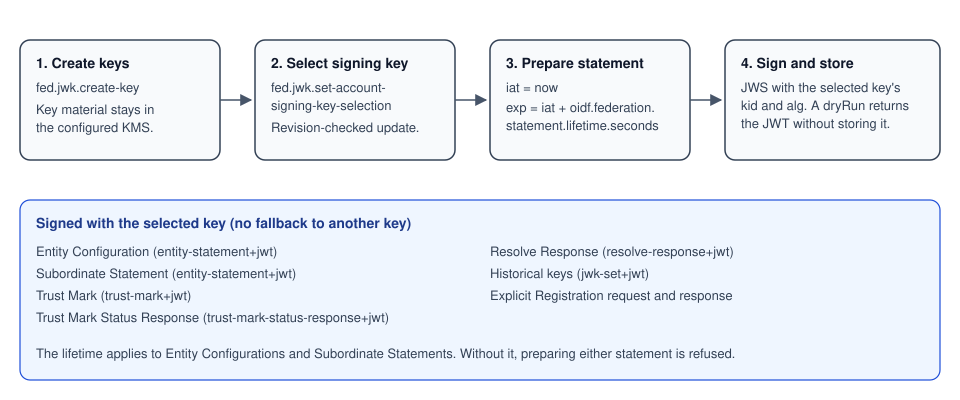
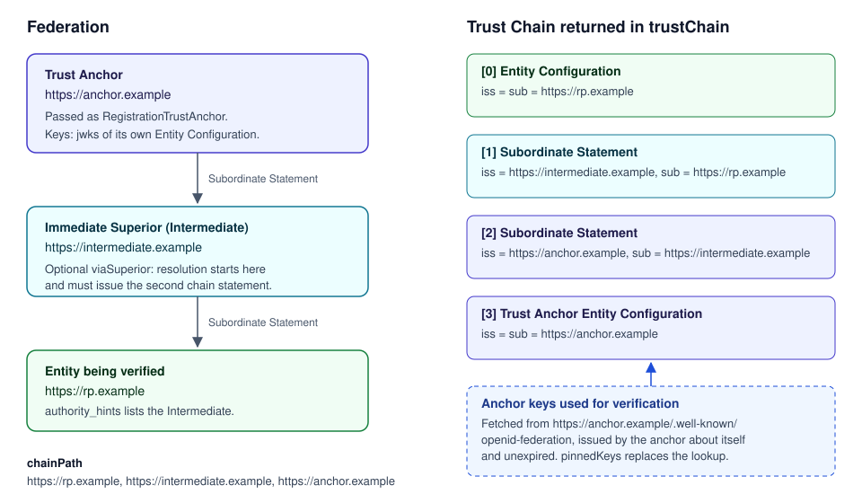

# OpenID Federation 1.1 library guide

This library implements the protocol side of OpenID Federation 1.1 as a set of service commands. A host application
uses it in two ways. An entity that joins existing federations uses it to manage its Federation Entity Keys, publish
its Entity Configuration, verify other entities through Trust Chains, and register as or accept OpenID Connect clients.
An entity that operates a federation, as Trust Anchor or as intermediate, also uses it to issue Subordinate Statements,
apply metadata policies and constraints, issue and revoke Trust Marks, and answer the federation endpoints.
[Entity onboarding](#entity-onboarding) and [Client onboarding](#client-onboarding) walk through admitting an entity to
a federation and registering a client with a provider step by step.

Section numbers in this guide refer to OpenID Federation 1.1 Final unless they are marked as OpenID Federation for
OpenID Connect 1.1 Final ("OIDC Federation" below).

## Concepts

An **Entity** is identified by its **Entity Identifier**, an https URL. It describes itself in an **Entity
Configuration**, a JWT it signs with one of its **Federation Entity Keys** and serves at
`<Entity Identifier>/.well-known/openid-federation` (§3, §9). A superior entity vouches for an entity below it with a
**Subordinate Statement** (§3.1.3), which names the keys of the subordinate and can carry metadata, a metadata policy
and constraints. The entity directly above another is its **Immediate Superior**, and the entity at the top that
everyone in the federation trusts is the **Trust Anchor**.

A **Trust Chain** (§4, §10) is the ordered list of statements from an entity's Entity Configuration, through the
Subordinate Statements of its superiors, up to a Trust Anchor. Verifying it means checking every signature against
the keys named one level up, ending at keys of the Trust Anchor that the verifier already trusts. Applying the
metadata policies along the chain produces the entity's **Resolved Metadata** (§6.1). A **Trust Mark** (§7) is a
signed statement by a Trust Mark issuer that an entity meets some criteria, identified by a Trust Mark type.

In this library every operation acts for an **account**: one entity the host operates, with its own Entity Identifier,
keys and federation data. Command arguments name it as `tenantId` or `accountId`.

## Using the library in a host application

Protocol work is exposed as `ServiceCommand` interfaces. Each interface has a stable command id in its `COMMAND_ID`
constant, takes a typed argument class and returns an `IdkResult` holding either the result or a `FederationError`.
The interfaces live in `com.sphereon.openid.fed.services.command.*` and `com.sphereon.openid.fed.client.command.*`.
A host depends on `com.sphereon.openid.fed:openid-federation-services`, which brings the service command interfaces
and their implementations, and `com.sphereon.openid.fed:openid-federation-client` for the Trust Chain and Trust Mark
client commands.

The implementations are Metro bindings contributed to the IDK session scope, and each command is also registered
under its command id. A host whose dependency graph includes these modules can inject a command interface into its
own session-scoped code and call `execute(args)`, or dispatch a command by id through the IDK command registry.

```kotlin
class AdmissionCheck(private val verifyEntityTrust: VerifyEntityTrustCommand) {
    suspend fun isMember(entityId: String, anchorId: String): Boolean =
        verifyEntityTrust.execute(
            VerifyEntityTrustArgs(
                entityIdentifier = entityId,
                trustAnchor = RegistrationTrustAnchor(anchorId),
            )
        ).isOk
}
```

The commands do not authorize callers. Several of them, documented as internal in their KDoc, expect the caller to
have resolved and authorized the exact account and pass `expectedEntityIdentifier` or a revision as a guard. The host
decides who may run which command, which Trust Anchors it accepts, and how it exposes the commands over HTTP. The
bundled admin server and federation server in this repository are one such host.

Federation data is stored in PostgreSQL. The persistence layer opens the database configured under
`oidf.datasource.*` and applies its schema migrations when it starts (see [Configuration](#configuration)).

## Joining an existing federation



### Federation Entity Keys and the signing key

`fed.jwk.create-key` (`CreateKeyCommand`) creates a key pair in the configured KMS and records its public JWK for the
account. The arguments choose the KMS provider, a `kmsKeyRef` alias and the JWS algorithm the KMS supports.
`fed.jwk.get-keys` lists the account's keys and `fed.jwk.revoke-key` revokes one. No key is created implicitly.

An account signs with exactly one selected key. `fed.jwk.set-account-signing-key-selection` sets it: the arguments
name the account, its expected Entity Identifier, the expected selection revision and the key id, and the update is
refused when the revision has moved on, the identifier does not match or the key is not an active key of the account.
Passing no key clears the selection. `fed.jwk.find-account-signing-key-selection` reads the current selection and
`fed.jwk.resolve-account-signing-key` resolves it to the key that signs (kid, algorithm, KMS reference). Revoking the
selected key clears the selection.

Every JWT the library signs for an account uses this key: Entity Configurations, Subordinate Statements, Trust Marks,
Trust Mark Status Responses, resolve responses, the historical keys JWT and Explicit Registration requests and
responses. There is no fallback to another key. Without a complete selection nothing is signed, and a publish request
that names a different `kid` or `kmsKeyRef` than the selected key is refused.

### Preparing and signing the Entity Configuration

The Entity Configuration is assembled from the account's stored components: metadata per Entity Type
(`fed.metadata.create`, `fed.metadata.find-by-account`, `fed.metadata.delete`), `authority_hints` naming its Immediate
Superiors (`fed.authority-hint.create`, `fed.authority-hint.find-by-account`, `fed.authority-hint.delete`),
`trust_anchor_hints` (`fed.trust-anchor-hint.*`), critical claims (`fed.critical-claim.*`) and the Trust Marks it holds
(`fed.received-trust-mark.*`). `fed.entity-configuration.replace-components` replaces the metadata and
`authority_hints` of an account in one call, for hosts that compute them elsewhere.

`fed.entity-configuration.find-by-account` prepares the statement. It sets `iat` to the current time and `exp` to
`iat` plus `oidf.federation.statement.lifetime.seconds`, lists the account's active keys in `jwks`, and adds the
stored components. It also adds `federation_entity` metadata (§5.1.1): an account that has subordinates, or has no
`authority_hints`, advertises the fetch and list endpoints; an account that issues Trust Marks, or is an authority,
advertises the Trust Mark status, listing and Trust Mark endpoints; every account advertises the resolve and
historical keys endpoints. The endpoint URLs are built from the Entity Identifier as `<id>/fetch`, `<id>/list`,
`<id>/resolve`, `<id>/trust-mark-status`, `<id>/trust-mark-list`, `<id>/trust-mark` and `<id>/historical-keys`. Trust
Mark types the account defines appear under `trust_mark_issuers`. A metadata policy is never placed in an Entity
Configuration; it belongs in Subordinate Statements (§3.1.3).

`fed.entity-configuration.publish` signs the prepared statement with the selected key (header `typ`
`entity-statement+jwt`) and stores it. With `dryRun` it returns the JWT without storing it.
`fed.entity-configuration.find-latest-stored-jwt` returns the last stored Entity Configuration, which is what a host
serves at the well-known location.

A host that prepares the Entity Configuration itself calls `fed.entity-configuration.sign-prepared` instead. It passes
the statement as JSON, the selected key id and the selection revision it prepared against. The command checks that
`iss` and `sub` equal the account's Entity Identifier, that every key in `jwks` is an active key of the account with
matching public material, that the selected key is among them and that the selection has not changed, and then returns
the signed JWT without storing it.

### Verifying an entity under a Trust Anchor

`fed.trust.verify-entity` (`VerifyEntityTrustCommand`) answers whether an entity is trusted under one Trust Anchor.



The Trust Anchor is passed as a `RegistrationTrustAnchor`, referenced by its https Entity Identifier. The anchor's
keys are taken from the Entity Configuration it publishes at its own `/.well-known/openid-federation`, which must be
issued by the anchor about itself and must not have expired. Keys from statements a counterparty supplies are never
used as anchor keys. `pinnedKeys` replaces the lookup with keys distributed another way; it is optional and not
normally set.

The command resolves the entity's Trust Chain by following its `authority_hints` up to the anchor (§10), verifies
every statement against that anchor's keys and checks that no statement has expired. When `viaSuperior` is set,
resolution starts only at that Immediate Superior, which must be listed in the entity's `authority_hints`, and the
second statement of the chain must be the Subordinate Statement that superior issued about the entity. This is how a
host confirms that a specific superior has admitted the entity.

`requiredTrustMarkTypes` lists Trust Mark types the entity must hold. For each type the command takes the Trust Mark
from the `trust_marks` claim of the entity's Entity Configuration and verifies it under the anchor's Entity
Configuration (§7.3), including the subject check. A missing or invalid mark fails the verification.

The result carries the verified `trustChain`, the `chainPath` (the entity, each superior and the Trust Anchor, in that
order), the verified Trust Mark types and `validUntilEpochSeconds`, the earliest expiry of the chain and the verified
Trust Marks. Failures return `TrustChainValidationFailedError` or `InvalidTrustAnchorError`.

The building blocks are also available on their own. `fed.client.get-entity-configuration` fetches an
Entity Configuration, `fed.client.resolve-trust-chain` resolves a chain to a list of Trust Anchors in preference
order, `fed.client.verify-trust-chain` verifies a chain, and `fed.client.verify-trust-mark` verifies a Trust Mark
against a Trust Anchor's Entity Configuration. `fed.resolution.verify-immediate-superior-statement` verifies a
Subordinate Statement an entity received from its superior, together with a chain to a Trust Anchor whose keys the
caller supplies, and returns the metadata that results from the chain's policies.

### Holding Trust Marks

An entity stores the Trust Marks issued to it with `fed.received-trust-mark.create` (the Trust Mark type and the JWT),
lists them with `fed.received-trust-mark.list` and removes them with `fed.received-trust-mark.delete`. Stored marks are
included in the `trust_marks` claim of the next Entity Configuration the account publishes.

### Registering as a client

Once admitted, an RP can register with OpenID Providers in the same federation through Automatic or Explicit
Registration. [Client onboarding](#client-onboarding) below summarizes the flow.

## Operating a federation

A Trust Anchor or intermediate is an account with subordinates. It publishes its own Entity Configuration as
described above; because it has subordinates, or no `authority_hints` in the case of a Trust Anchor, that Entity
Configuration advertises the authority endpoints.

### Subordinates and Subordinate Statements

`fed.subordinate.create` registers a subordinate by its Entity Identifier, and `fed.subordinate.find-by-account` and
`fed.subordinate.delete` list and remove subordinates. The operator records the subordinate's Federation Entity Keys
that it has reviewed with `fed.subordinate.create-jwk` (`fed.subordinate.get-jwks`, `fed.subordinate.delete-jwk`).
The library does not take these keys from the subordinate's Entity Configuration by itself: the Subordinate
Statement vouches for exactly the keys the operator recorded, and a subordinate without recorded keys gets no
statement.

Metadata the superior asserts about a subordinate is stored with `fed.subordinate.create-metadata`
(`fed.subordinate.find-metadata`, `fed.subordinate.delete-metadata`). Constraints (§6.2: `max_path_length`,
`naming_constraints`, `allowed_entity_types`) are set per subordinate with `fed.subordinate-constraint.set` and read
or removed with `fed.subordinate-constraint.get` and `fed.subordinate-constraint.delete`. Constraints are validated
when the statement is prepared, and invalid stored constraints stop the statement from being issued.

`fed.subordinate.get-statement` prepares the Subordinate Statement: `iss` is the account, `sub` the subordinate,
`exp` is `iat` plus the configured statement lifetime, `source_endpoint` is the account's fetch endpoint, and the
statement carries the recorded keys, the subordinate metadata, the account's metadata policies and the constraints.
`fed.subordinate.publish-statement` signs it with the selected key and stores it, or returns it without storing when
`dryRun` is set. `fed.subordinate.fetch-statement` returns the stored statement for an `iss` and `sub` pair, which is
what the fetch endpoint (§8.1) serves. Statements expire with the configured lifetime, so an operator publishes them
again before they expire.

### Metadata policies

An account has at most one metadata policy per Entity Type, created with `fed.metadata-policy.create`, listed with
`fed.metadata-policy.find-by-account` and removed with `fed.metadata-policy.delete`. The key is the Entity Type
identifier and the policy is an object that maps metadata parameter names to policy operators (§6.1). The library
validates the policy when it is created with the operators defined in §6.1.3 (`value`, `add`, `default`, `one_of`,
`subset_of`, `superset_of`, `essential`) and their combination rules, and refuses a malformed policy with
`InvalidRequestError`. Every Subordinate Statement the account issues carries its policies in `metadata_policy`.

### Trust Marks

A Trust Anchor declares the Trust Mark types of its federation with `fed.trust-mark.create-type`
(`fed.trust-mark.find-all-types-by-account`, `fed.trust-mark.find-type-by-id`, `fed.trust-mark.delete-type`) and the
entities allowed to issue each type with `fed.trust-mark.add-issuer-to-type` (`fed.trust-mark.get-issuers-for-type`,
`fed.trust-mark.remove-issuer-from-type`). The next Entity Configuration lists them in `trust_mark_issuers`, which is
what verifiers check a Trust Mark issuer against (§7.3).

An issuer issues a Trust Mark with `fed.trust-mark.create`: the subject Entity Identifier, the Trust Mark type, and
optionally `exp`, `logo_uri`, `ref` and `delegation`. The mark is signed with the selected key (header `typ`
`trust-mark+jwt`) and stored, unless `dryRun` is set. `fed.trust-mark.list-issued` lists the marks the account issued
and has not revoked, each with the id used for revocation, its type, subject, JWT, `iat` and `exp`.
`fed.trust-mark.delete` revokes a mark; it stays known to the status evaluation as revoked.

The Trust Mark endpoints are answered by these commands:

| Spec | Command | Result |
| --- | --- | --- |
| §8.4 Trust Mark Status | `fed.trust-mark.get-signed-status-jwt` | A Trust Mark Status Response JWT (§8.4.2, `typ` `trust-mark-status-response+jwt`) with `iss`, `iat`, the evaluated `trust_mark` and `status`. `fed.trust-mark.get-status` returns the same evaluation unsigned. |
| §8.5 Trust Marked Entities Listing | `fed.trust-mark.get-marked-subs` | The subjects holding an active, unexpired mark of a type, optionally narrowed to one `sub`. |
| §8.6 Trust Mark | `fed.trust-mark.get` | The latest active Trust Mark for a type and subject. |

The status of a submitted Trust Mark JWT is evaluated against the marks the account issued. A mark the account issued
is `revoked` once revoked, `expired` once its `exp` has passed, and `active` otherwise. A JWT the account does not know
is `revoked` when the account revoked a mark of that type for that subject, `expired` when its own `exp` has passed,
and `invalid` otherwise.

### Historical keys and resolve responses

`fed.jwk.get-federation-historical-keys-jwt` returns the historical keys JWT (§8.7, `typ` `jwk-set+jwt`) listing all
keys the account has used, revoked ones included, so that statements signed with retired keys can still be checked.

`fed.resolution.resolve-entity` implements the resolve endpoint logic (§8.3). It resolves the subject's Trust Chain to
one of the requested Trust Anchors, verifies it, applies the metadata policies to produce Resolved Metadata, filters
it by the requested Entity Types and includes the subject's Trust Marks that verify under the selected anchor. The
response expires at the earliest expiry in the chain, and at most 24 hours after it is issued.
`fed.resolution.get-signed-resolve-response-jwt` signs that response with the selected key (`typ`
`resolve-response+jwt`).

The list endpoint (§8.2) is served from the account's subordinates; the bundled federation server supports the
`entity_type`, `intermediate`, `trust_marked` and `trust_mark_type` filters. Endpoint errors follow §8.9.

## Entity onboarding

Entity onboarding is how an entity becomes a member of a federation: an Immediate Superior, which is the Trust Anchor
or an intermediate below it, issues a Subordinate Statement about the entity, and the entity confirms that its Trust
Chain through that superior verifies. OpenID Federation 1.1 defines no enrollment endpoint for this, so the two
parties exchange the onboarding details out of band and each runs the library calls on its own side. The steps below
assume both parties use this library; a counterparty using other software follows the same protocol steps.

### Step 1, candidate: prepare the entity

The candidate creates its Federation Entity Keys with `fed.jwk.create-key` and selects the signing key with
`fed.jwk.set-account-signing-key-selection`. It names the superior in its `authority_hints` with
`fed.authority-hint.create`, stores its metadata with `fed.metadata.create`, and publishes its Entity Configuration
with `fed.entity-configuration.publish`. The host serves the stored JWT at
`<Entity Identifier>/.well-known/openid-federation`. Publishing requires the statement lifetime and the selected key
to be configured.

### Step 2, candidate: hand over the onboarding details

The candidate gives the superior's operator its Entity Identifier and its Federation Entity Keys, for example the
public JWKs returned by `fed.jwk.get-keys`, through whatever channel the federation uses for admission.

### Step 3, superior: record the subordinate and its reviewed keys

The superior registers the candidate with `fed.subordinate.create`. Its operator compares the keys received in step 2
with the `jwks` of the candidate's published Entity Configuration, which `fed.client.get-entity-configuration`
fetches, and records each key it accepts with `fed.subordinate.create-jwk`. The library takes no keys from the
candidate by itself: the Subordinate Statement vouches for exactly the recorded keys, and a subordinate without
recorded keys gets no statement. Because chain verification checks the candidate's Entity Configuration against these
keys, the recorded keys must include the key the candidate signs with.

### Step 4, superior: set metadata, policies and constraints

Optional metadata the superior asserts about the candidate goes in with `fed.subordinate.create-metadata`, and
constraints such as `max_path_length`, `naming_constraints` and `allowed_entity_types` with
`fed.subordinate-constraint.set`. The superior's metadata policies (`fed.metadata-policy.create`) apply to every
Subordinate Statement it issues, so the candidate's Resolved Metadata will be its own metadata after these policies.

### Step 5, superior: publish the Subordinate Statement

`fed.subordinate.get-statement` shows the statement that will be signed, and `fed.subordinate.publish-statement`
signs it with the superior's selected key and stores it; with `dryRun` it returns the signed JWT without storing it.
The superior's own Entity Configuration must be published and current so that it advertises its fetch endpoint
(`<superior id>/fetch`), where the host answers with `fed.subordinate.fetch-statement`. The statement expires after
`oidf.federation.statement.lifetime.seconds`, so the superior publishes it again before it expires.

### Step 6, candidate: confirm admission

The candidate runs `fed.trust.verify-entity` with its own Entity Identifier, the federation's Trust Anchor as a
`RegistrationTrustAnchor`, and `viaSuperior` set to the superior from step 3. The command starts resolution at that
superior, requires the second chain statement to be the superior's Subordinate Statement about the candidate, and
verifies the chain against the keys the Trust Anchor publishes itself. Success confirms the admission; the result's
`chainPath` shows the path to the anchor and `validUntilEpochSeconds` shows how long the evidence holds. When the
superior is the Trust Anchor itself, `viaSuperior` is the anchor's Entity Identifier. Adding
`requiredTrustMarkTypes` also confirms that the candidate holds valid Trust Marks of those types.

### Keeping membership current

The membership lasts as long as both statements are renewed. The candidate publishes its Entity Configuration again
before it expires and after changing keys or metadata. When the candidate rotates its Federation Entity Keys, the
superior records the new keys and publishes a new Subordinate Statement before the candidate signs with them; the
candidate then repeats step 6.

## Client onboarding

Client onboarding registers an RP with an OpenID Provider (or an OAuth 2.0 client with an authorization server) that
are both admitted to a federation, as described in OpenID Federation for OpenID Connect 1.1 §12.
[CLIENT-REGISTRATION.md](CLIENT-REGISTRATION.md) walks through both flows step by step, with what each command
verifies, the inputs a host supplies, lifetimes and errors:

- [Automatic Registration](CLIENT-REGISTRATION.md#automatic-registration-121) (§12.1): the RP uses its Entity
  Identifier as `client_id` and proves control of a published key in its first request; the OP verifies it with
  `fed.registration.verify-automatic`, or resolves an RP by Entity Identifier with `fed.registration.resolve-client`.
- [Explicit Registration](CLIENT-REGISTRATION.md#explicit-registration-122) (§12.2): the RP creates a signed request
  with `fed.registration.create-explicit-request`, the OP verifies it with `fed.registration.verify-explicit-request`
  (as `application/entity-statement+jwt` or `application/trust-chain+json`) and signs the response with
  `fed.registration.sign-explicit-response`, and the RP verifies the response with
  `fed.registration.verify-explicit-response`.

In both flows the host passes the Trust Anchors it accepts as `RegistrationTrustAnchor` values referenced by their
https Entity Identifier, with optional pinned keys, as for `fed.trust.verify-entity`.

## Configuration

Configuration is read through the IDK configuration pipeline, so every key can come from YAML or properties files,
from environment variables or from host-contributed sources. [CONFIGURATION.md](CONFIGURATION.md) describes the
sources and their precedence. Two groups of keys matter for the commands above.

`oidf.federation.statement.lifetime.seconds` (environment `OIDF_FEDERATION_STATEMENT_LIFETIME_SECONDS`) sets how long
the Entity Configurations and Subordinate Statements the library prepares stay valid, in seconds. It is required and
has no default: until it is set, preparing either statement fails with a server error saying the lifetime is not
configured. Deployments typically use 3600 seconds and publish again before statements expire.

```yaml
oidf:
  federation:
    statement:
      lifetime:
        seconds: 3600
```

`oidf.datasource.url`, `oidf.datasource.user` and `oidf.datasource.password` (environment `OIDF_DATASOURCE_URL`,
`OIDF_DATASOURCE_USER`, `OIDF_DATASOURCE_PASSWORD`, with the older `DATASOURCE_URL`, `DATASOURCE_USER` and
`DATASOURCE_PASSWORD` still accepted) point the library at its PostgreSQL database. The URL, user and password are
required. Instead of a cleartext password, `oidf.datasource.password.secret.id` names a secret that is resolved from
the environment variable `OIDF_SECRET_<ID>`.

```yaml
oidf:
  datasource:
    url: jdbc:postgresql://db:5432/openid-federation-db
    user: openid-federation-db-user
    password: openid-federation-db-password
```

The federation endpoint authentication keys (`oidf.federation.endpoint.auth.*`, §8.8) and the optional freshness
limits for offline Trust Chains (`oidf.client.offline.trust.chain.*`) are described in
[CONFIGURATION.md](CONFIGURATION.md).
